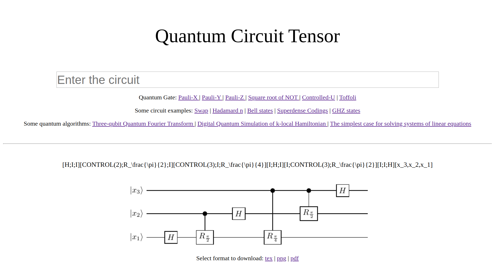
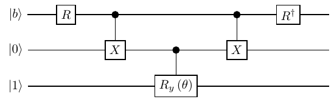
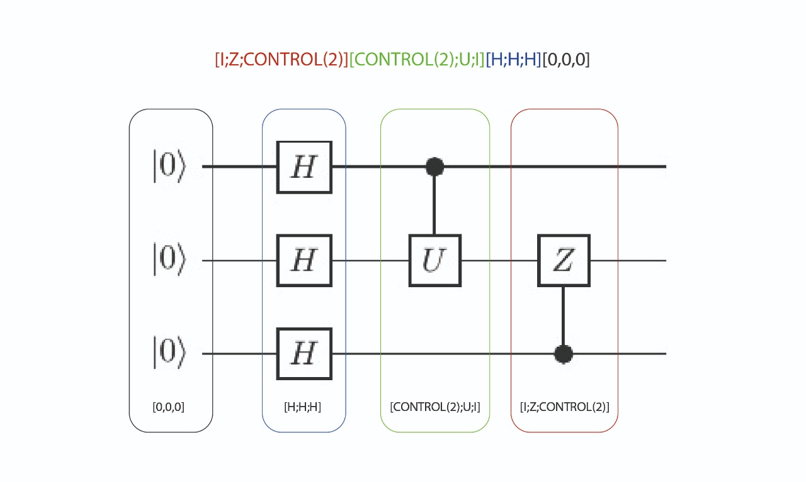

# Description

Quantum circuit tensor (QCT) is developed in PHP which allows to generate quantum circuits in an easy way as a PNG, PDF or Tex file

# Installation

```git clone https://github.com/NUN-LABS/QCT-PHP.git```

After clonning QCT into local, go to directory ```cd QCT```, and execute

```chmod 777 -R ./QCTInstall_v0.1.sh```

```./QCTInstall_v0.1.sh```

You can verify current installation by openning localhost on your default browser.

# Execution

Follow localhost instructions to set up your environment.

When everything's working you should see an image as this



If you don't see something like this port 80 could be busy by another process, 
execute ```sudo ss -ntlp 'sport = 80'``` to verify if anyother process is using port 80.

# Tests

[Composer](https://getcomposer.org) must be installed to execute unitary tests

After installation ```Composer install``` must be executed on QCT directory 
to install dependencies

To test successfully, at start of QCT.php file are three lines which must be commented and another three lines which must be uncommented. Read carefully the commentaries on that file.

Then tests can be executed by executing this command line on terminal from QCT project directory.

```vendor/bin/phpunit tests/*.php```

# Usage

Qubits on input expression must be separated by colons and inside brackets

```[0,0,0]```

Input expression's gates must be separated by semicolons and inside brackets

```[I;CONTROL(3);X]```

QCT recognizes LaTeX symbols

```[R^\dagger;I;I][CONTROL(2);X;I][I;CONTROL(3);R_y\left(\theta\right)][CONTROL(2);X;I][R;I;I][b,0,1]```




Is always necessary a set of qubits and at least another one of gates
Each set represents a column on the quantum circuit

Full input expression example:

```[I;Z;CONTROL(2)][CONTROL(2);U;I][H;H;H][0,0,0]```




# Pendings for v0.2: 

1. Oracle   
2. Measure   

# Pendings for v0.3: 

1. Circuit as a matrix      
2. Simulation  


